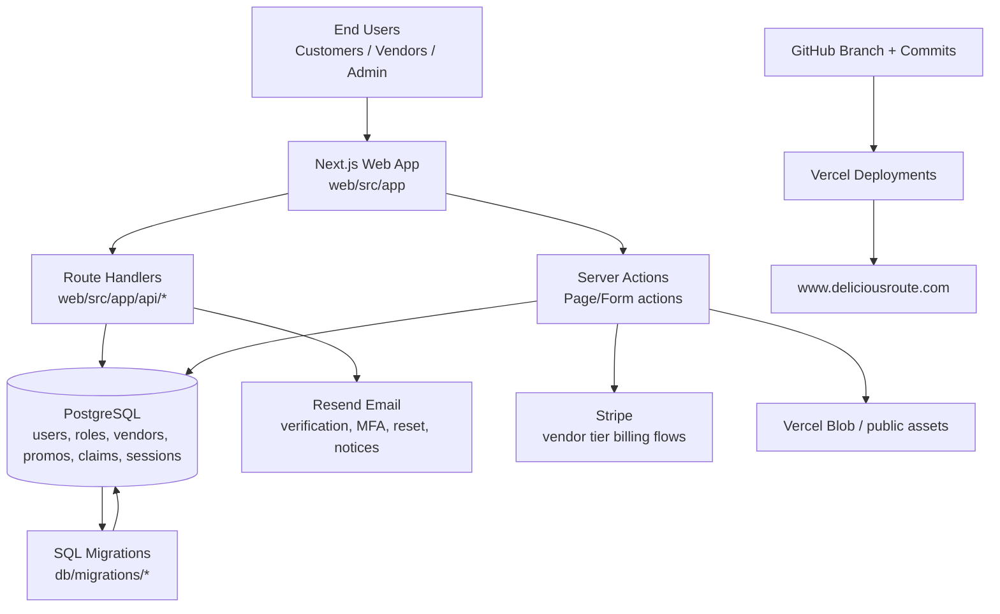

# Delicious Route - Project Versioning and Developer Handoff

## Document Metadata

- Project: Delicious Route
- Repository: braarup/DeliciousRoute
- Branch at time of writing: feat/public-tier-content-enforcement
- Snapshot commit at time of writing: 58c8f39
- Date: 2026-05-11
- Runtime stack: Next.js 16 (App Router), React 19, TypeScript, PostgreSQL, Vercel

## 1) Executive Summary

Delicious Route is a food-truck discovery and engagement platform with role-based experiences for customers and vendors. Core functionality includes vendor discovery, account auth with email verification and MFA, vendor profile/content management, subscription-tier controls, and promo claiming/redeeming with QR scanning.

This document is designed so another developer can resume ownership quickly, understand current architecture and release history, and continue versioning safely.

## 2) System Wire Diagram



## 3) Top-Level Repository Layout

```text
db/
  schema.sql
  migrations/
web/
  src/
    app/            # App Router pages and API route handlers
    components/     # Shared UI and client components
    lib/            # Auth, email, billing, policy utilities
    data/           # Static/data helper modules
    types/          # Project type augmentations
  public/           # Static web assets used at runtime
Images/             # Source/reference image assets (non-runtime)
docs/               # Project documentation (this file)
```

## 4) Section-by-Section Architecture

### 4.1 App Router and Pages

- Location: web/src/app
- Purpose: Route-based UI and server-rendered pages.
- Key route groups:
  - Public marketing/browse pages: /, /vendors, /vendor/[id], about/contact/legal.
  - Auth flows: /login, /signup, /verify-email, /reset-password.
  - Customer area: /customer/profile.
  - Vendor area: /vendor/profile, /vendor/login, /vendor/signup.
  - Admin area: /admin/vendors.

### 4.2 API Route Handlers

- Location: web/src/app/api
- Purpose: Backend HTTP entry points for auth, password reset, favorites, reels, vendors, Stripe webhook, and signout.
- Notable handlers:
  - Auth reset + forgot-password routes.
  - Stripe webhook billing synchronization.
  - Vendor/customer data endpoints used by UI.
  - Signout route: POST /api/auth/signout (session destroy + redirect).

### 4.3 Authentication and Session Model

- Location: web/src/lib/auth.ts and related auth routes/pages.
- Pattern:
  - Session cookie: dr_session.
  - DB-backed sessions table with revoked/expires checks.
  - Email verification and MFA challenge flow.
  - Role-driven routing (consumer vs vendor_admin vs super_admin).

### 4.4 Vendor Promo and Claim System

- Relevant pages/components:
  - Vendor public promo claim UI: web/src/app/vendor/[id]/page.tsx
  - Vendor redeem UI: web/src/app/vendor/profile/page.tsx
  - Scanner component: web/src/components/PromoCodeScanner.tsx
  - Customer claimed promos: web/src/app/customer/profile/page.tsx
- DB entities:
  - vendor_promos
  - customer_promo_claims
- Behaviors:
  - One claim per customer per promo.
  - Claimed vs redeemed status lifecycle.
  - Redeemed deals cannot be reclaimed.
  - QR-based redemption workflow with scanner + manual code path.

### 4.5 Billing and Vendor Tiering

- Stripe integration and webhook flows support vendor plan states.
- Tier gating controls feature availability (for example menu/reel/media capabilities).
- Subscription state affects vendor content visibility and capabilities.

### 4.6 Email and Notification System

- Location: web/src/lib/email.ts
- Provider: Resend
- Templates/flows include:
  - Email verification
  - MFA challenge
  - Password reset
  - Profile/security change notifications

### 4.7 Database Schema and Migrations

- Base schema: db/schema.sql
- Incremental changes: db/migrations/\*.sql
- Critical domains:
  - users, roles, user_roles
  - sessions, auth token/challenge tables
  - vendors, vendor media/menus/reels
  - subscriptions/billing events
  - promos/claims and redemption tracking

## 5) Runtime and Environment Details

### 5.1 Application Dependencies (web/package.json)

- Next 16.0.10
- React 19.2.1
- @vercel/postgres
- @vercel/blob
- Stripe
- Resend
- @zxing/browser (cross-platform QR scanning)

### 5.2 Environment Variables (Observed/Expected)

- NEXT_PUBLIC_APP_BASE_URL or APP_BASE_URL
- VERCEL_PROJECT_PRODUCTION_URL
- RESEND_API_KEY
- Stripe keys and webhook secret(s)
- Vercel Blob token(s)

## 6) Build, Test, Deploy Runbook

### 6.1 Local Development

1. cd web
2. npm install
3. npm run dev
4. Open http://localhost:3000

### 6.2 Quality Checks

1. npm run lint
2. Run critical path manual checks:
   - Login -> MFA -> profile landing
   - Vendor promo claim + redeem
   - Customer profile claimed promos visibility
   - Password reset link domain behavior

### 6.3 Production Deploy (Current Practice)

1. Commit and push branch changes to GitHub.
2. Deploy via Vercel CLI from repo root:
   - vercel --prod --yes
3. Validate alias points to https://www.deliciousroute.com.

## 7) Release History

### Session: 2026-05-11 (commits 6c4af03, 9cf61e3, 58c8f39)

Branch: feat/public-tier-content-enforcement

**Changes delivered:**

1. **Mobile sign out fix** (`6c4af03`)
   - Replaced `<form>` POST with a `fetch("/api/auth/signout", { method: "POST" })` call
     followed by `window.location.href = "/"`.
   - Root cause: `onClick={() => setMenuOpen(false)}` was unmounting the slide-over menu
     (and the form inside it) before the POST request could fire.
   - Also added explicit `response.cookies.delete("dr_session")` to the POST route handler
     (`web/src/app/api/auth/signout/route.ts`) to guarantee the cookie is cleared even
     when `destroySession()` alone is insufficient on the response object.

2. **Vendor profile mobile section navigation** (`9cf61e3`)
   - Mobile/tablet view of `/vendor/profile` now shows a section nav list instead of
     the full scrollable page.
   - Tapping a section opens only that section's card with a "‹ Back to profile" link.
   - Desktop layout is completely unchanged (all sections always visible).
   - Implementation: `?section=<id>` query param drives visibility; `mobileSectionDefs`
     array defines the 9 sections; `mobileHide(sectionId)` returns `"hidden lg:block"`
     when that section is not active.
   - Section IDs: `basic`, `links`, `photos`, `menu`, `hours`, `reel`, `gps`, `promos`,
     `security`.

3. **Next.js 16 `searchParams` Promise fix** (`58c8f39`)
   - Root cause of section nav doing nothing: Next.js 16 changed `searchParams` from a
     plain object to a `Promise`. Reading `.section` on an unawaited Promise always
     returns `undefined`.
   - Fix: type changed to `Promise<{...}>`, awaited at top of component:
     `const sp = await (searchParams ?? Promise.resolve({}))`.
   - All 10 usages of `searchParams?.xxx` replaced with `sp.xxx`.
   - **Applies to all App Router page components** — any page using `searchParams` must
     await it on Next.js 16.

### Session: 2026-05-11 (commit fbddf9e) — prior baseline

Branch: feat/public-tier-content-enforcement

- Mobile hamburger signout flow (earlier version)
- iOS-compatible QR scanner (@zxing/browser)
- Promo redemption modal visibility improvements
- Verify image update in public runtime assets

## 8) Current Known Good Baseline

- Latest documented release commit: 58c8f39
- Branch: feat/public-tier-content-enforcement
- Production URL: https://www.deliciousroute.com

## 9) Architectural Notes — Important Gotchas

### Next.js 16: `searchParams` is a Promise

In Next.js 16 App Router, `searchParams` passed to page components is a **Promise**,
not a plain object. You must `await` it before reading any property.

```ts
// WRONG (works in Next.js 14/15, silently broken in Next.js 16)
export default async function Page({ searchParams }: { searchParams: { foo?: string } }) {
  const value = searchParams?.foo; // undefined — searchParams is a Promise
}

// CORRECT
export default async function Page({
  searchParams,
}: {
  searchParams: Promise<{ foo?: string }>;
}) {
  const sp = await (searchParams ?? Promise.resolve({}));
  const value = sp.foo;
}
```

### Mobile sign out: use fetch(), not a form

Any sign-out button inside a React component that can be unmounted (e.g. a slide-over
menu closed by an `onClick`) must use `fetch()` + `window.location.href` instead of
a raw `<form>` POST. Closing the component that contains the form cancels the request.

## 8) Version History (Recent)

| Date (relative) | Commit  | Summary                                      |
| --------------- | ------- | -------------------------------------------- |
| 2026-05-11      | fbddf9e | Update verify image and mobile signout fix   |
| 2026-05-11      | d0a77fa | Add mobile sign out to hamburger menu        |
| 2026-05-11      | c9a8cc5 | Add iOS-compatible QR camera scanning        |
| 2026-05-11      | 645e030 | Portal-based modal visibility fix            |
| 2026-05-11      | b534c37 | Mobile modal visibility improvements         |
| 2026-05-11      | bc411ad | Blocking modal for promo redemption status   |
| 2026-05-11      | 43c0517 | Promo claim/redemption UX refinement         |
| 2026-05-11      | e2775d9 | Fix MFA redirect swallowed by catch          |
| 2026-05-11      | f4cd481 | Canonical domain in reset links              |
| 2026-05-11      | 3990ae5 | MFA challenge fallback for mobile            |
| 2026-05-11      | 08dec9b | Replace account_type checks with role checks |
| 2026-05-11      | eef7d85 | Vendor promos, claim limits, QR redemption   |

## 9) Resume Development Checklist

1. Confirm branch and sync latest remote.
2. Pull DB schema context and run pending migrations.
3. Verify required environment variables in the target environment.
4. Run local smoke tests for auth + promo paths.
5. Validate static assets (especially CheckVerify/checkverify references) for case-sensitive hosts.
6. Create a release note entry for each deployment commit.

## 10) Versioning Guidance Going Forward

- Use semantic commit subjects with clear subsystem scope.
- Maintain a rolling HISTORY section in this document or a dedicated CHANGELOG.
- For each release, capture:
  - Commit SHA
  - Deployed URL and alias
  - DB migration impact
  - Risk notes and rollback instructions

## 11) Risks and Watch Items

- File case sensitivity differences between Windows and Linux hosts (CheckVerify vs checkverify).
- Mobile browser behavior around camera permissions and autoplay.
- Ensuring role-based checks are used consistently over deprecated columns.
- Environment drift between local, preview, and production (URLs/secrets).

## 12) Ownership Handoff Notes

- This document should be updated at each meaningful release.
- Keep deployment metadata attached to commit records.
- If ownership transfers, review Sections 6-11 first before feature work.
